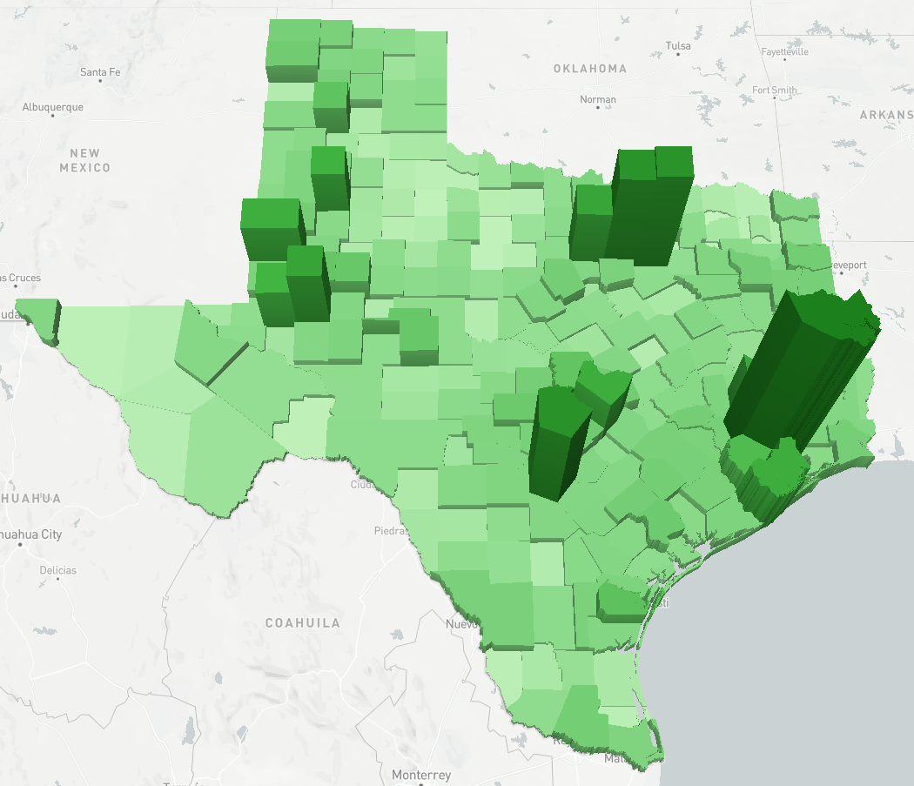
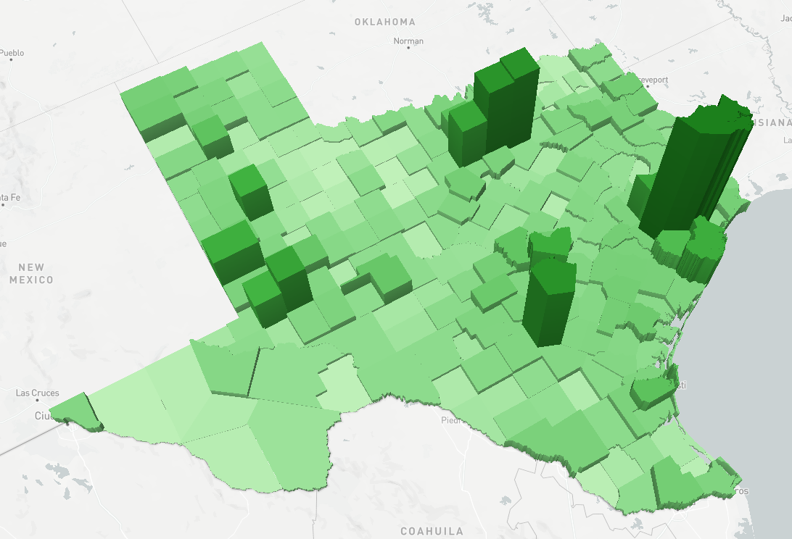
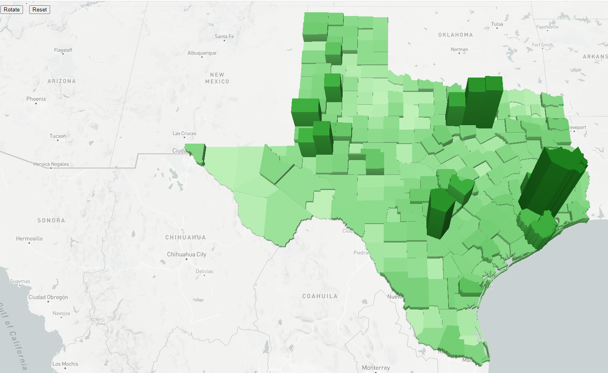

# texas-water-art
Texas Water Well Well Density Maps
1. Choropleth
    - 
2. [02_counties_wells_3d.html](http://127.0.0.1:5500/02_counties_wells_3d.html)
    - Made the counties extrude (3d based on number of water wells in the county)
    - 
3. [03_counties_wells_3d_rotate.html](http://127.0.0.1:5500/03_counties_wells_3d_rotate.html)
    - Added a map rotate button, so you can see around the stacks
    - 
4. [04_counties_wells_3d_rotate_anim.html](http://127.0.0.1:5500/04_counties_wells_3d_rotate_anim.html)
    - Trying to get it to animate for slick effect. Trying to get it to look like: http://104.236.16.91:8650/oil-gas-deckgl/
    - 