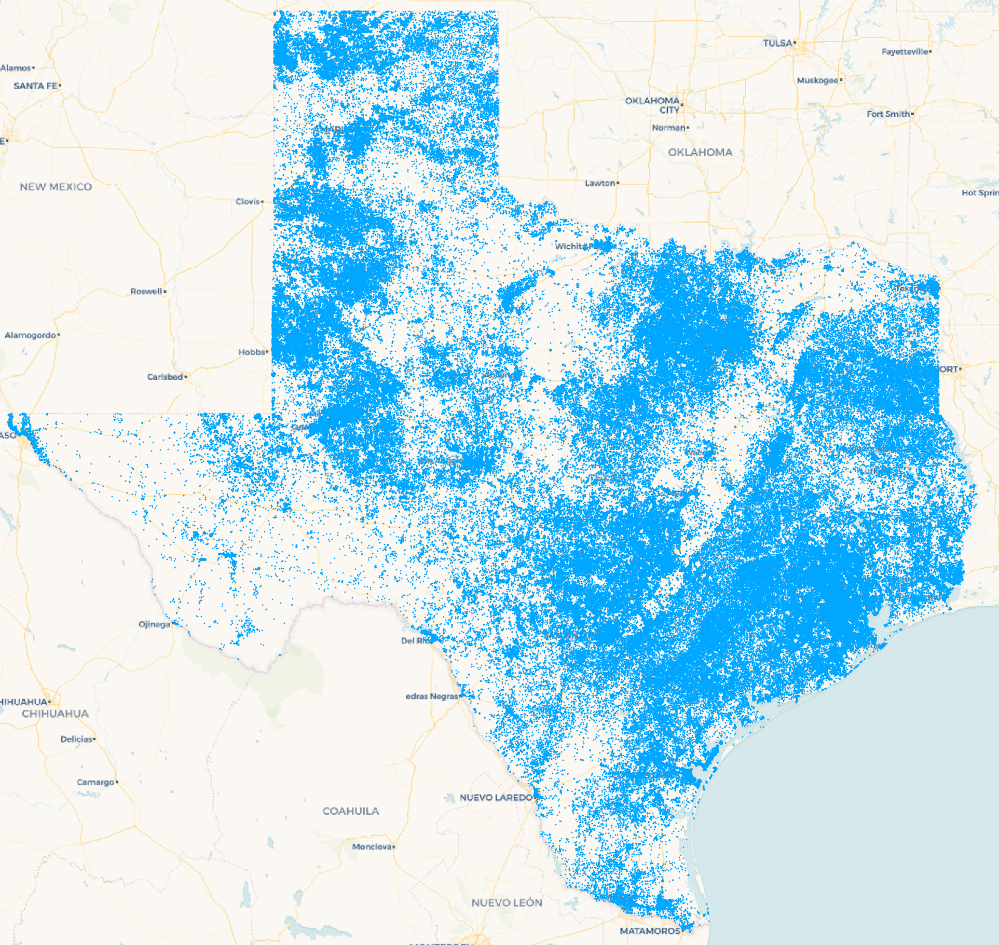

### Texas Water Well Well Density

This map shows the source water well data in Texas. There are 622,445 well points. Data Source: Wally Darling

### Water Well Density Hexbin Maps

The following web maps give a sense of the density of Water Wells in Texas.

1. [Texas Water Well Density By County Flat Cloropleth Map](https://fergusdevelopmentllc.github.io/texas-water-art-v2/01.html)
    - 
    - 
    - 
2. [Texas Water Well Density By County Extruded Cloropleth Map](https://fergusdevelopmentllc.github.io/texas-water-art-v2/02.html)
    - 
    - 
    - 
3. [Texas Water Well Density Extruded Cloropleth Map (11 mile hexbin)](https://fergusdevelopmentllc.github.io/texas-water-art-v2/03.html)
    - 
    - 
    - 
4. [Texas Water Well Density Extruded Cloropleth Map (4.5 mile hexbin)](https://fergusdevelopmentllc.github.io/texas-water-art-v2/04.html)
    - 
    - 
    - 