### Texas Water Well Well Density

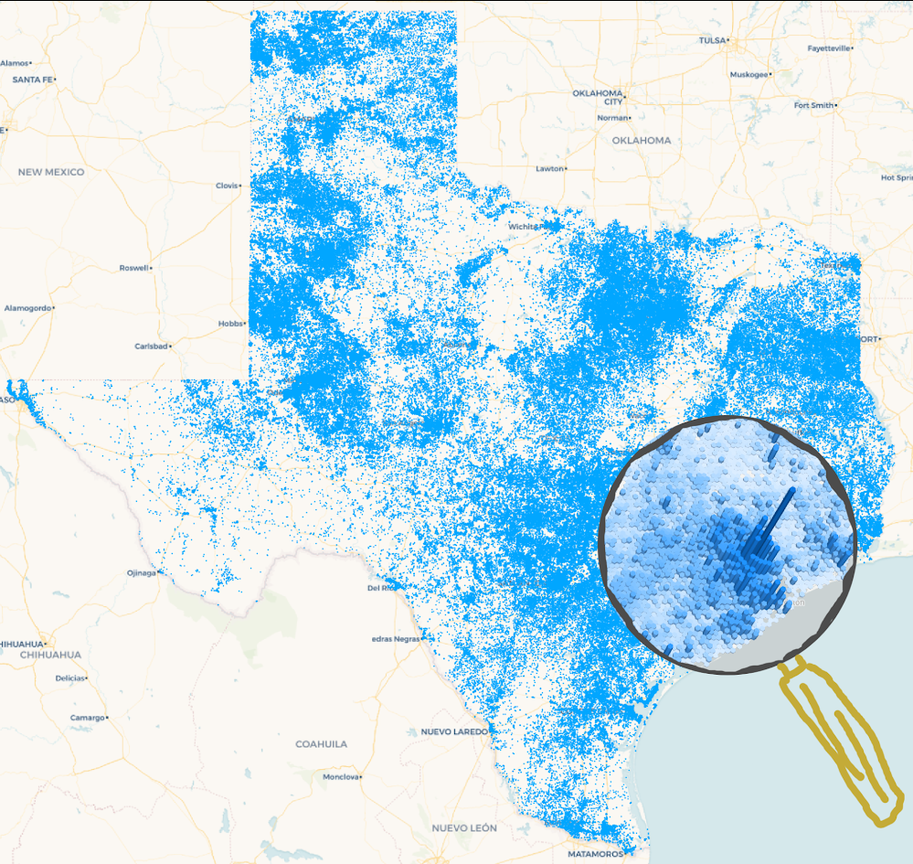

This map shows the source water well data in Texas. There are 622,445 well points. Data Source: Wally Darling

### Water Well Density Hexbin Maps

The following web maps give a sense of the density of the Water Wells in Texas using the map hexbinning.

[Texas Water Well Density By County Flat Cloropleth Map](https://fergusdevelopmentllc.github.io/texas-water-art-v2/01.html)

    <a href="https://fergusdevelopmentllc.github.io/texas-water-art-v2/01.html?color=blue" target='_blank'>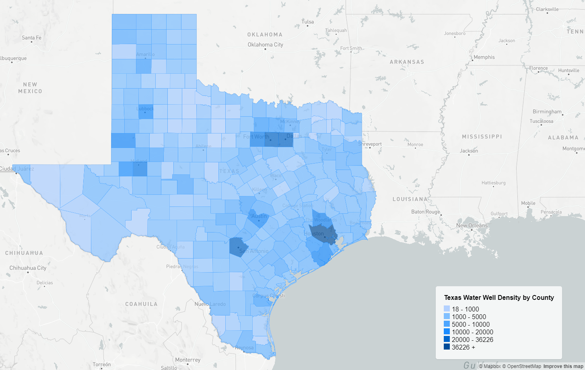</a>
    <a href="https://fergusdevelopmentllc.github.io/texas-water-art-v2/01.html?color=green" target='_blank'>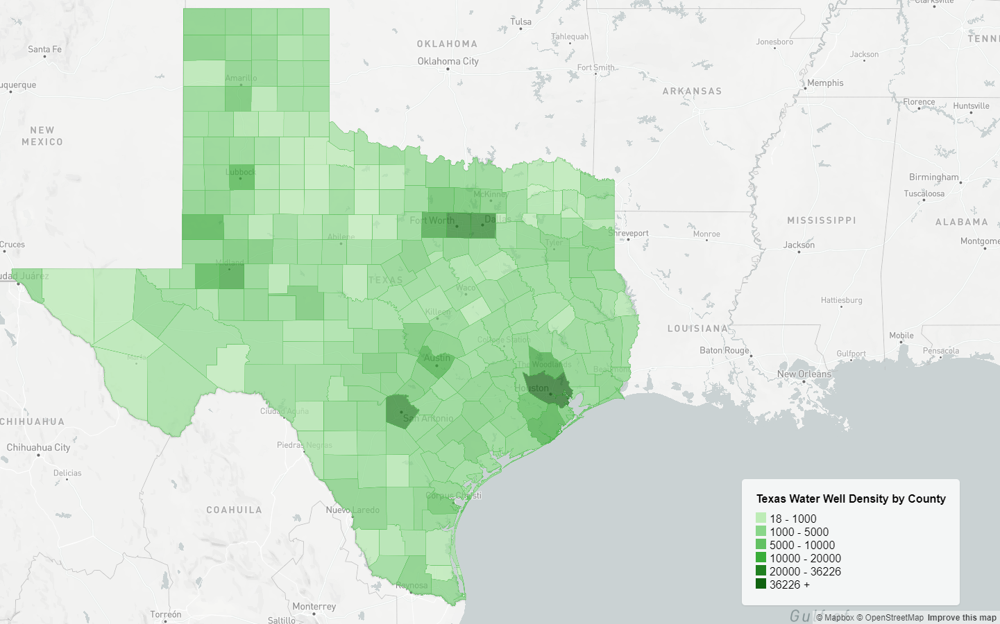</a>
    <a href="https://fergusdevelopmentllc.github.io/texas-water-art-v2/01.html?color=orange" target='_blank'>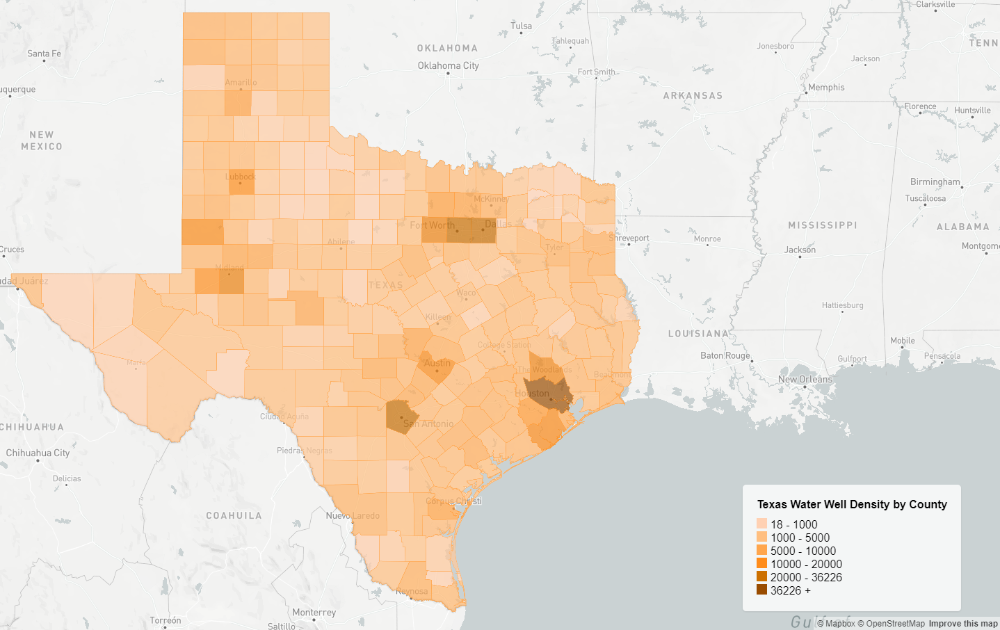</a>

[Texas Water Well Density By County Extruded Cloropleth Map](https://fergusdevelopmentllc.github.io/texas-water-art-v2/02.html)

    <a href="https://fergusdevelopmentllc.github.io/texas-water-art-v2/02.html?color=blue" target='_blank'>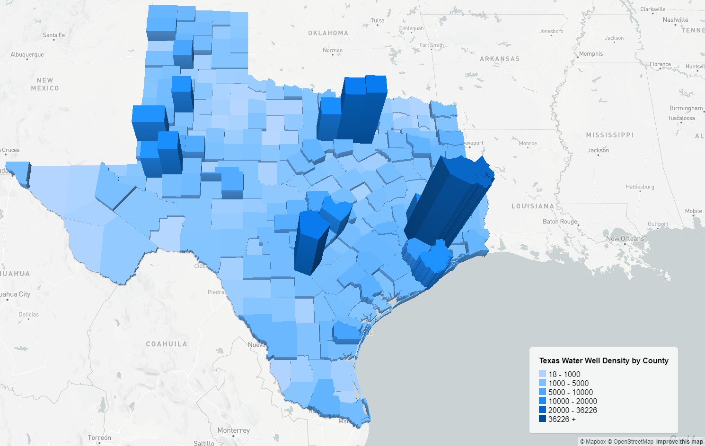</a>
    <a href="https://fergusdevelopmentllc.github.io/texas-water-art-v2/02.html?color=green" target='_blank'>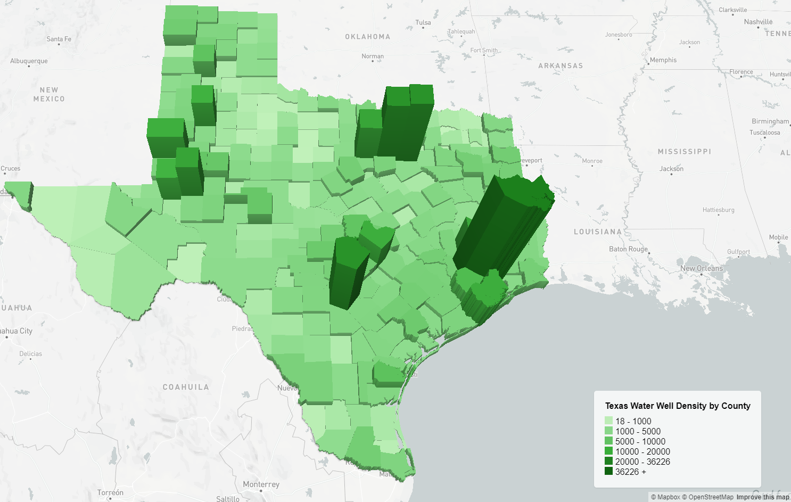</a>
    <a href="https://fergusdevelopmentllc.github.io/texas-water-art-v2/02.html?color=orange" target='_blank'>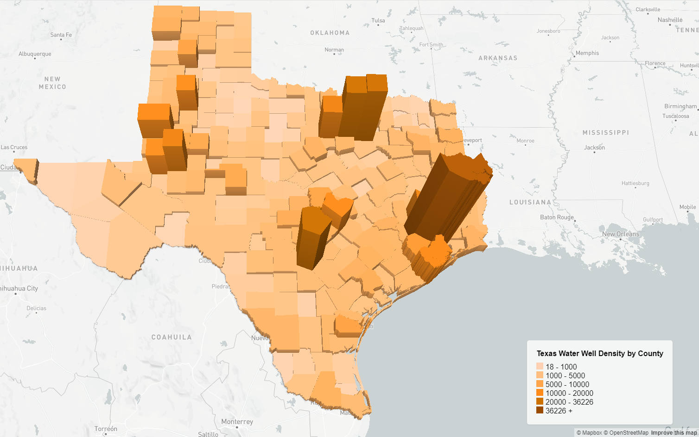</a>

[Texas Water Well Density Extruded Cloropleth Map (11 mile hexbin)](https://fergusdevelopmentllc.github.io/texas-water-art-v2/03.html)

    <a href="https://fergusdevelopmentllc.github.io/texas-water-art-v2/03.html?color=blue" target='_blank'>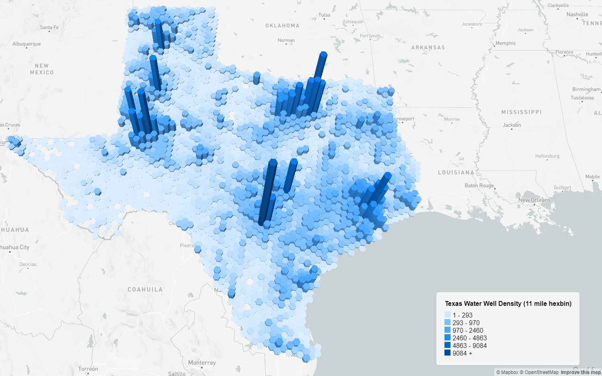</a>
    <a href="https://fergusdevelopmentllc.github.io/texas-water-art-v2/03.html?color=green" target='_blank'>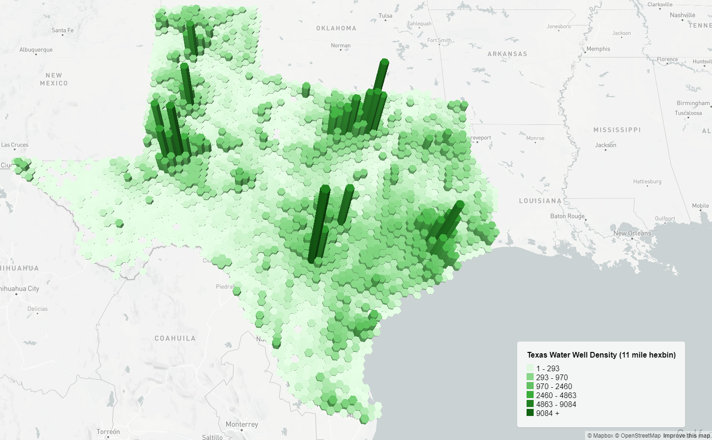</a>
    <a href="https://fergusdevelopmentllc.github.io/texas-water-art-v2/03.html?color=orange" target='_blank'>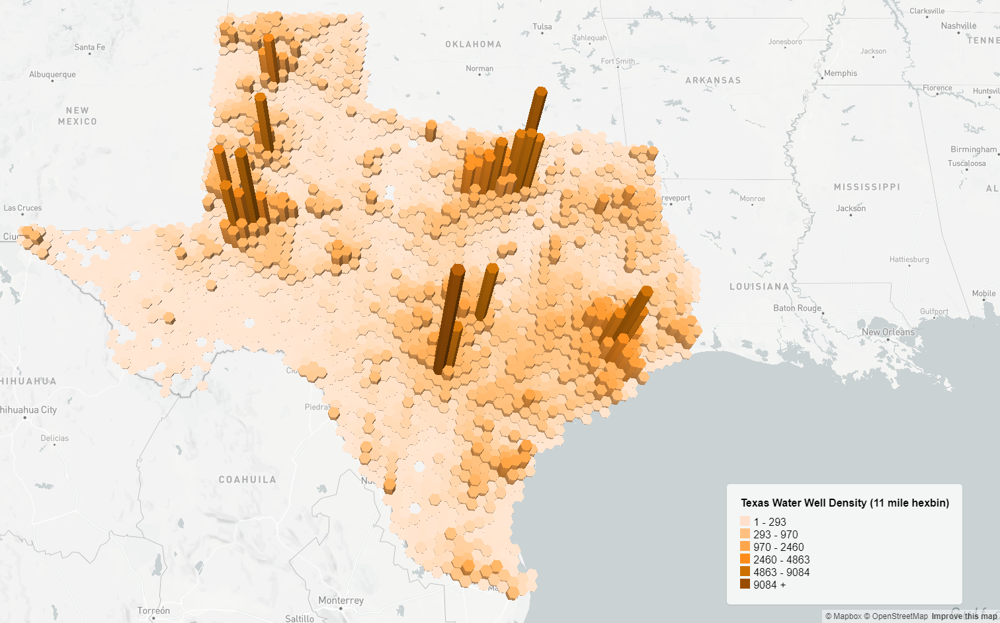</a>

[Texas Water Well Density Extruded Cloropleth Map (4.5 mile hexbin)](https://fergusdevelopmentllc.github.io/texas-water-art-v2/04.html)

    <a href="https://fergusdevelopmentllc.github.io/texas-water-art-v2/04.html?color=blue" target='_blank'>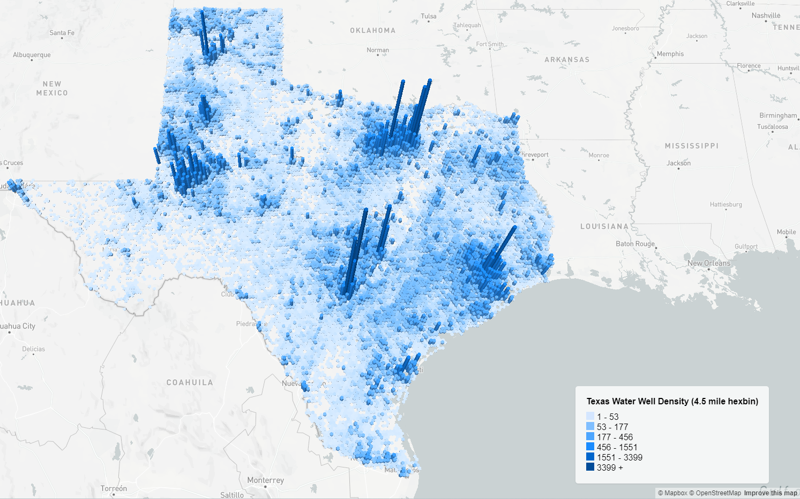</a>
    <a href="https://fergusdevelopmentllc.github.io/texas-water-art-v2/04.html?color=green" target='_blank'>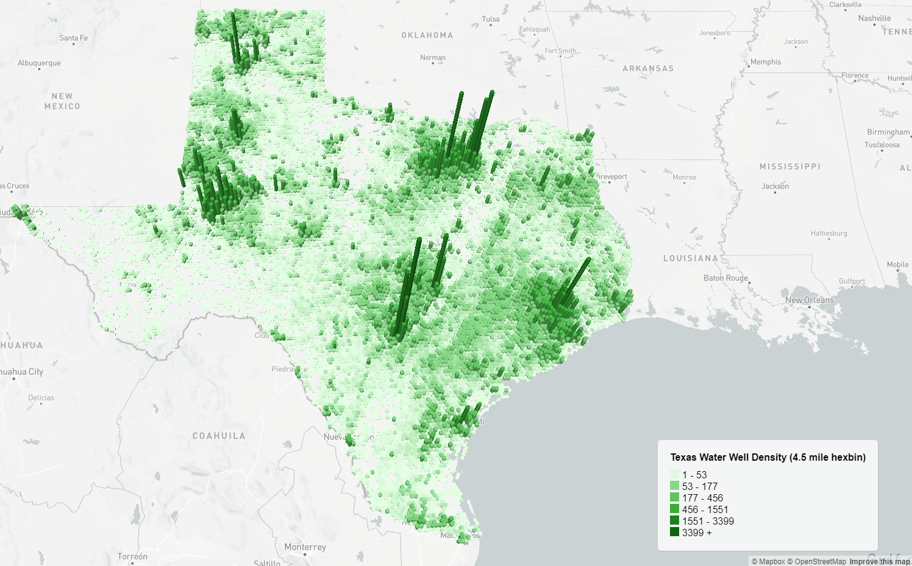</a>
    <a href="https://fergusdevelopmentllc.github.io/texas-water-art-v2/04.html?color=orange" target='_blank'>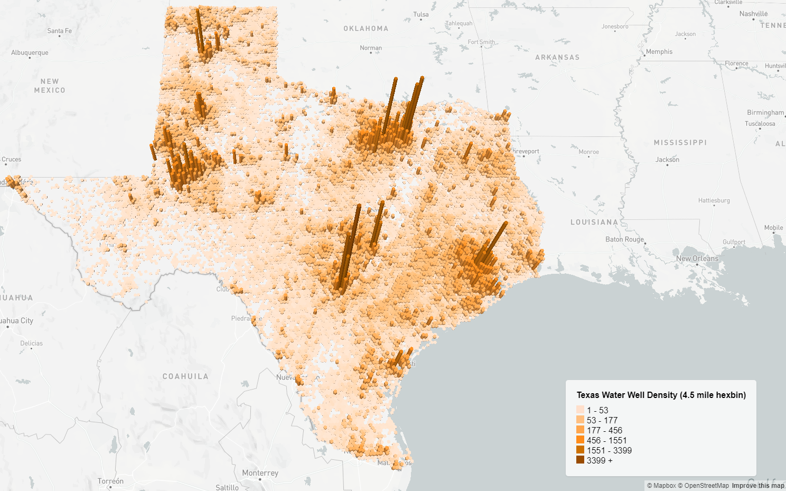</a>

